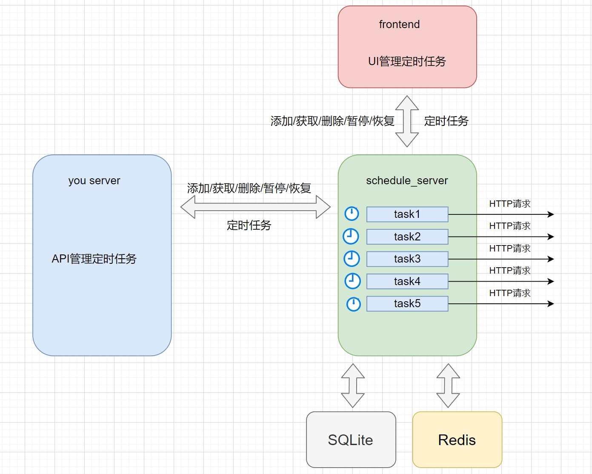
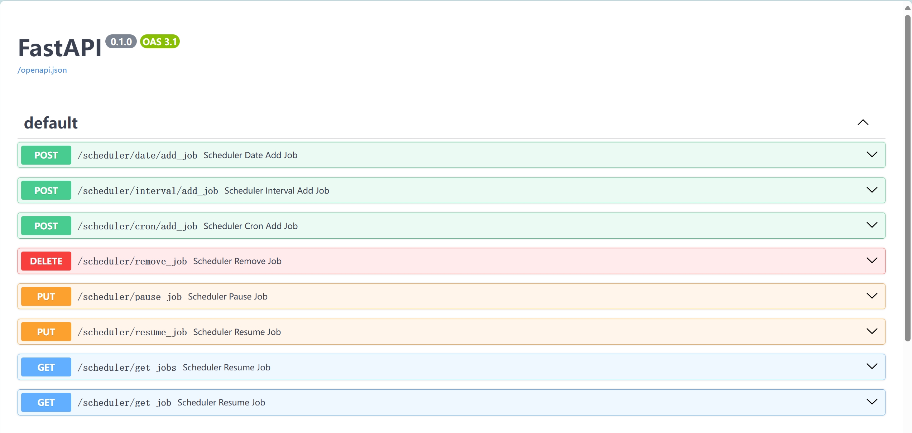
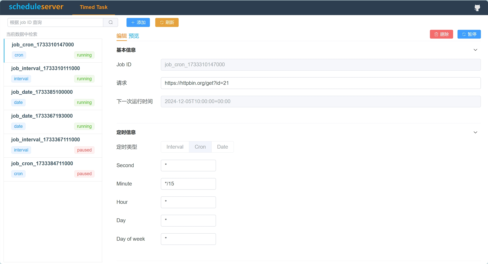
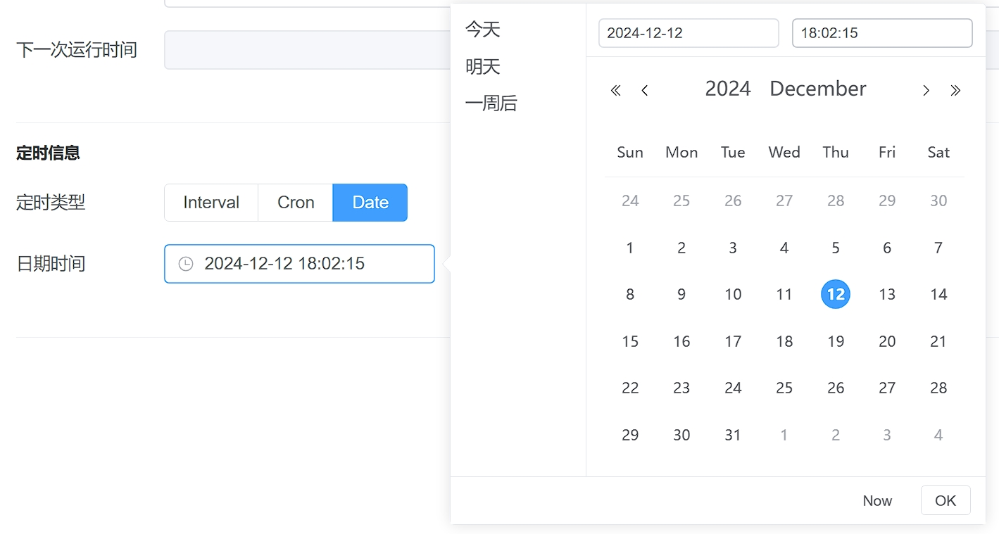
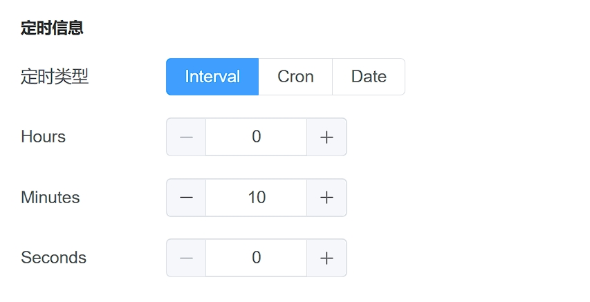
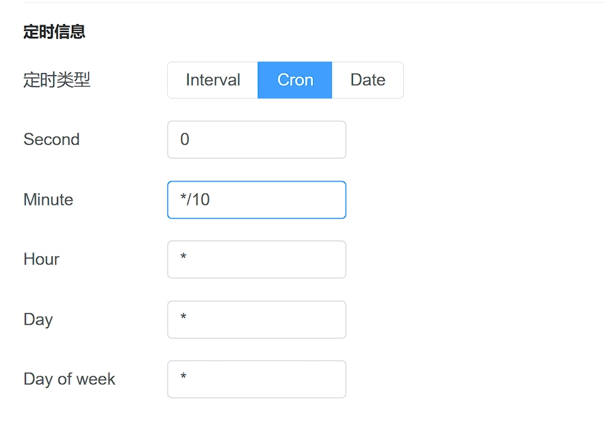

# 通用的定时任务工具 schedule-server

> 背景: 我曾经在一个自动化测试平台中集成定时任务，基于 APScheduler 库花了好长时间解决重复执行的问题。定时任务集成在服务中也让服务变得复杂。最后，我们选择了公司其他团队go语言开发的一个定时任务服务。于是萌生了想法，和不用 Python实现一个通用的定时任务服务。于是，schedule-server应运而生。

GitHub地址: https://github.com/SeldomQA/schedule-server

## schedule-server 特点

* 运行与部署简单。
* 基于HTTP触发请求。
* 支持三种类型的定时任务：`crontab`、`interval`、`date`
* 支持定时任务的`查询`、`删除`、`添加`、`暂停/恢复`等操作。


## schedule-server 架构图



* `schedule_server`: 核心功能是定时触发HTTP请求。
* `fontend`: 通过前端UI管理定时任务。
* `you server`: 在你的服务中通过调接口的方式管理定时任务。
* `SQLite`: 用于保存定时任务服务。
* `Redis`: 通过Redis锁解决重复触发的问题。

## 安装与运行

__安装依赖__ 

```shell
> cd schedule_server
> pip install -r requirements.txt
```

__开发运行__

```shell
> uvicorn main:app --reload

INFO:     Will watch for changes in these directories: ['/.../schedule-server/schedule_server']
INFO:     Uvicorn running on http://127.0.0.1:8000 (Press CTRL+C to quit)
INFO:     Started reloader process [21905] using StatReload
INFO:     Started server process [21907]
INFO:     Waiting for application startup.
```


__查看API__

访问URL: http://127.0.0.1:8000/docs




## 前端服务

使用schedule_server服务可以不需要前端，但是，你想可视化的方法管理定时任务，我还为此专门开发了个前端服务。

__安装依赖__

```shell
> npm install
```

__运行服务__ 

```shell
> npm run dev

> wiremock-ui@0.0.1 dev
> vite
  VITE v4.3.9  ready in 3426 ms
  ➜  Local:   http://localhost:5173/
  ➜  Network: use --host to expose
  ➜  press h to show help
```

__访问前端页面__

访问url: http://localhost:5173/




## 定时类型

schedule-server支持三种定时类型：`crontab`、`interval`、`date`，可以满足不同的需求。

__date类型__

data类型比较简单，适合固定的`日期时间`触发定时任务。

* 调用接口

  * URL：http://127.0.0.1:8000/scheduler/date/add_job
  * Method: `POST`
  * Type: `JSON`

```json
{
  "job_id": "date_job_111",
  "url": "https://httpbin.org/get?id=111",
  "year": 2022,
  "month": 11,
  "day": 18,
  "hour": 7,
  "minute": 0,
  "second": 0
}
```

* 前端配置




__interval类型__

interval适合间隔时间`重复执行`的定时任务。

* 调用接口

  * URL：http://127.0.0.1:8000/scheduler/interval/add_job
  * Method: `POST`
  * Type: `JSON`

```json
{
  "job_id": "interval_job_222",
  "url": "https://httpbin.org/get?id=222",
  "hours": 0,
  "minutes": 0,
  "seconds": 10
}
```

* 前端配置




__cron类型__

conn使一种复杂的定时任务，能够支持所有的定时任务需求。

* 调用接口

  * URL：http://127.0.0.1:8000/scheduler/cron/add_job
  * Method: `POST`
  * Type: `JSON`

```json
{
  "job_id": "cron_job_333",
  "url": "https://httpbin.org/get?id=333",
  "second": "0",
  "minute": "*/3",
  "hour": "*",
  "day": "*",
  "month": "*",
  "day_of_week": "*"
}
```

> 可以参考这个网站学习：https://tooltt.com/crontab-parse/

* 前端配置




## 说明

> 作为独立的定时任务服务， seldom-platfrom平台已经以非常低的成本接入了schedule-server服务，用于实现测试任务的定时触发，这种服务拆分方式有利于后期项目的维护和可插拔。schedule-server项目本身也可以有更多的应用场景。